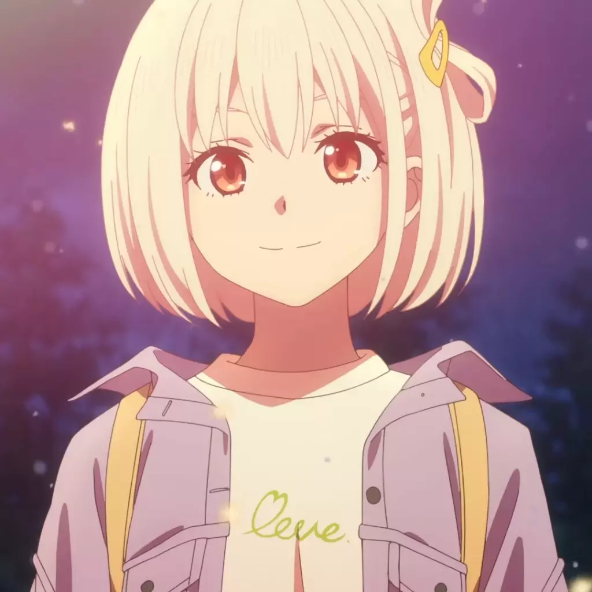
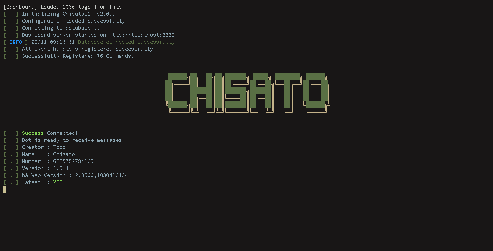
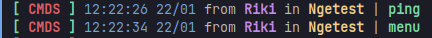
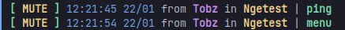
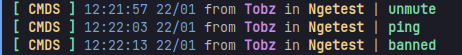
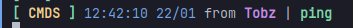
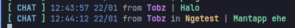
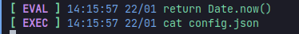

<p align="center">
    
</p>
<h1 align="center">ChisatoBOT</h1>
<h3 align="center">This bot uses a library from Baileys</h3>
<h3 align="center">Give this repository a ⭐ if you like it</h3>

<div align="center">

[![Contributors][contributors-shield]][contributors-url]
[![Forks][forks-shield]][forks-url]
[![Stargazers][stars-shield]][stars-url]
[![Issues][issues-shield]][issues-url]
[![GPL3 License][license-shield]][license-url]

</div>

<div align="center">

[![JOIN WITH OUT COMMUNITY][community-shield]][community-url]

</div>

## Description

<p align="center">
    
</p>

-   Chisato is a WhatsApp bot with various functions
-   There are various features available on Chisato BOT
-   ChisatoBOT has a beautiful terminal logger

## Table of Contents

-   [Getting Started](#getting-started)
-   [Build With](#build_with)
-   [Installation](#installation)
-   [Documentation](#documentation)
-   [Community](#community)

## Getting Started

What is needed to run this project :

-   [GIT](https://git-scm.com/downloads)
-   [NodeJS version 16+](https://nodejs.org/en/)
-   [FFMPEG](https://ffmpeg.org/download.html)
-   [WEBP](https://storage.googleapis.com/downloads.webmproject.org/releases/webp/index.html)
-   You need a Chinese Proxy for the Image to Anime feature
-   You need the [OCR Space API KEY](https://ocr.space) to run the OCR feature

If you have problems, you can [open an issue](https://github.com/TobyG74/ChisatoBOT/issues) or join the community to ask questions about it

### Setup Your Mongodb

-   Login to the [MongoDB](https://account.mongodb.com/account/login) website
-   Create your Database
-   Next, select the Database that you created again or click (Database > Connect > Drivers > Copy Your Application Code)
-   Paste the mongodb code that you copied into the .env file and don't forget to change `<password>` to your database password

### Setup Your `.env` File

-   Edit your [.env](https://github.com/TobyG74/ChisatoBOT/blob/master/.env.example) file
-   Rename `.env.example` to `.env`

## Built With


## Installation

### Clone this Project

```
git clone https://github.com/TobyG74/ChisatoBOT
cd ChisatoBOT
```

### Install Dependencies

```
npm install
```

### Setup Prisma

```
npx prisma db push
```

### Build Project

```
npm run build
```

### Run Project

-   Run with PM2

```
npm run pm2:start
```

-   Without PM2

```
npm start
```

---

## Documentation

### Configuration File [config.json](https://github.com/TobyG74/ChisatoBOT/blob/master/config.json)

```json
{
    "ownerNumber": ["YOUR_NUMBER"],
    "teamNumber": [],
    "timeZone": "Asia/Jakarta",
    "prefix": ".",
    "maintenance": [], // List Maintenance Command
    "stickers": {
        "author": "Instagram : ini.tobz",
        "packname": "Made by ChisatoBOT"
    },
    "settings": {
        "ownerNotifyOnline": false,
        "selfbot": false,
        "useLimit": false,
        "useCooldown": true,
        "autoReadMessage": true,
        "autoReadStatus": true
    },
    "call": {
        "status": "reject" // reject, block, off
    },
    "limit": {
        "command": 30
    },
    "cfonts": {
        "font": "block",
        "align": "center",
        "colors": ["green", "yellow"],
        "background": "transparent",
        "letterSpacing": 0,
        "lineHeight": 0,
        "space": true,
        "maxLength": "0",
        "gradient": false,
        "independentGradient": false,
        "transitionGradient": false,
        "env": "node"
    }
}
```

### Config Commands

-   Command configuration that you can use

```ts
type ConfigCommands = {
    name: string;
    alias: string[];
    usage: string;
    category: string;
    description: string;
    cooldown?: number; // in seconds
    limit?: number;
    example?: string;
    isOwner?: boolean;
    isTeam?: boolean;
    isPrivate?: boolean;
    isPremium?: boolean;
    isGroup?: boolean;
    isGroupAdmin?: boolean;
    isGroupOwner?: boolean;
    isBotAdmin?: boolean;
    isProcess?: boolean;
    run: (args: CommandsObject) => unknown;
};
```

### Maintenance Command

-   To change the command to maintenance status, just type : `.commandname -m`
-   To change it again, type the same command

### Log Messages for those affected by Banned or Blocked



### Log Messages for Groups that are Muted



### Log Messages for Commands in Group Chat



### Log Messages for Commands in Private Chat



### Log Messages for Regular Messages



### Log Messages for Eval & Exec Message



---

## Community

-   Special thanks to the bot community below who helped develop ChisatoBOT

<table>
    <tr>
        <td align="center" valign="top" width="14.28%">
            <a href="https://github.com/TobyG74">
                
                <br>
                <bold>TobyG74</bold>
            </a>
        </td>
        <td align="center" valign="top" width="14.28%">
            <a href="https://github.com/arugaz">
                
                <br>
                <bold>Arugaz</bold>
            </a>
        </td>
        <td align="center" valign="top" width="14.28%">
            <a href="https://github.com/nugraizy">
                
                <br>
                <bold>Nugraizy</bold>
            </a>
        </td>
        <td align="center" valign="top" width="14.28%">
            <a href="https://github.com/zennn08">
                
                <br>
                <bold>Zennn08 (Aqul)</bold>
            </a>
        </td>
    </tr>
    <tr>
        <td align="center" valign="top" width="14.28%">
            <a href="https://github.com/mrhrtz">
                
                <br>
                <bold>MRHRTZ</bold>
            </a>
        </td>
        <td align="center" valign="top" width="14.28%">
            <a href="https://github.com/mhankbarbar">
                
                <br>
                <bold>Mhankbarbar</bold>
            </a>
        </td>
        <td align="center" valign="top" width="14.28%">
            <a href="https://github.com/itzngga">
                
                <br>
                <bold>ItzNgga</bold>
            </a>
        </td>
        <td align="center" valign="top" width="14.28%">
            <a href="https://github.com/itzngga">
                
                <br>
                <bold>xbnfz01</bold>
            </a>
        </td>
    </tr>
    <tr>
        <td align="center" valign="top" width="14.28%">
            <a href="https://github.com/faizbastomi">
                
                <br>
                <bold>Faiz Bastomi</bold>
            </a>
        </td>
        <td align="center" valign="top" width="14.28%">
            <a href="https://github.com/alphanum404">
                
                <br>
                <bold>Alphanum404</bold>
            </a>
        </td>
    </tr>
</table>

-   Special Thanks for My Teams

<table>
  <tr>
    <td align="center">
        
        <br>
        <a href="https://github.com/Hidden-Finder">
            <bold>Hidden-Finder</bold>
        </a>
    </td>
    <td align="center">
        
        <br>
        <a href="https://github.com/botw3a">
            <bold>BOTWEA</bold>
        </a>
    </td>
   </tr> 
  </tr>
</table>

[contributors-shield]: https://img.shields.io/github/contributors/TobyG74/ChisatoBOT.svg?style=for-the-badge
[contributors-url]: https://github.com/TobyG74/ChisatoBOT/graphs/contributors
[forks-shield]: https://img.shields.io/github/forks/TobyG74/ChisatoBOT.svg?style=for-the-badge
[forks-url]: https://github.com/TobyG74/ChisatoBOT/network/members
[stars-shield]: https://img.shields.io/github/stars/TobyG74/ChisatoBOT.svg?style=for-the-badge
[stars-url]: https://github.com/TobyG74/ChisatoBOT/stargazers
[issues-shield]: https://img.shields.io/github/issues/TobyG74/ChisatoBOT.svg?style=for-the-badge
[issues-url]: https://github.com/TobyG74/ChisatoBOT/issues
[license-shield]: https://img.shields.io/github/license/TobyG74/ChisatoBOT.svg?style=for-the-badge
[license-url]: https://github.com/TobyG74/ChisatoBOT/blob/main/LICENSE
[community-shield]: https://img.shields.io/badge/JOIN%20WITH%20OUR%20COMMUNITY-FFFFFF?style=for-the-badge&logo=whatsapp&logoColor=0FB830
[community-url]: https://whatsapp.com/channel/0029VaGQpAOKAwEfkKNh6Z0X
